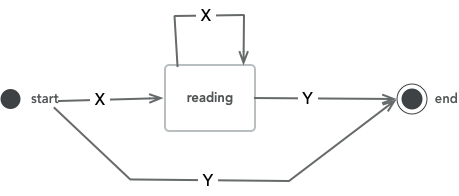
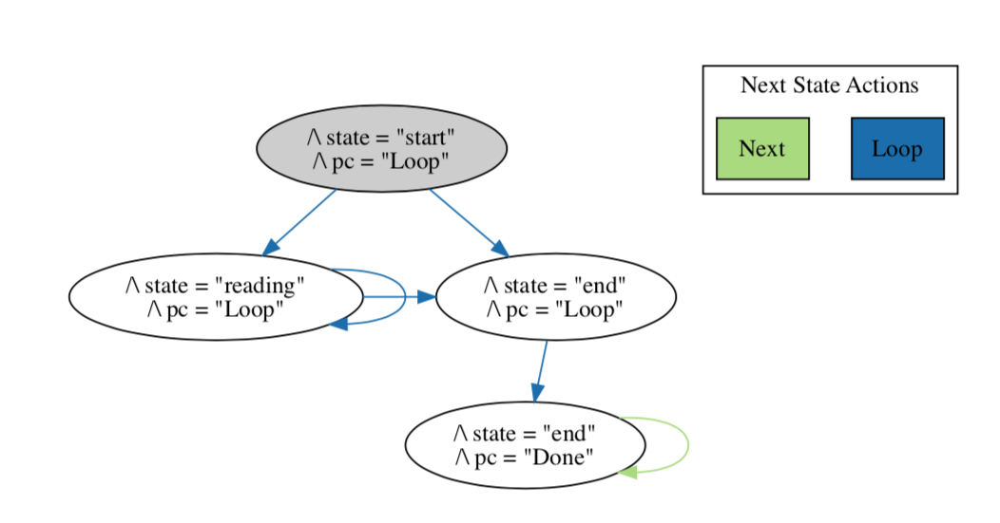

# Tiny TLA+ Example:  State Machine

This example models a trivial state machine that accepts the regular expression `X*Y` (i.e. zero or more X followed by a Y).

The state diagram looks like this:

Since we have modelled the machine using PlusCal, the TLA+ model also includes a variable called `PC` (for "program counter") representing the current point of execution.  The model checker therefore finds *4* states (instead of 3) with the following state diagram:

